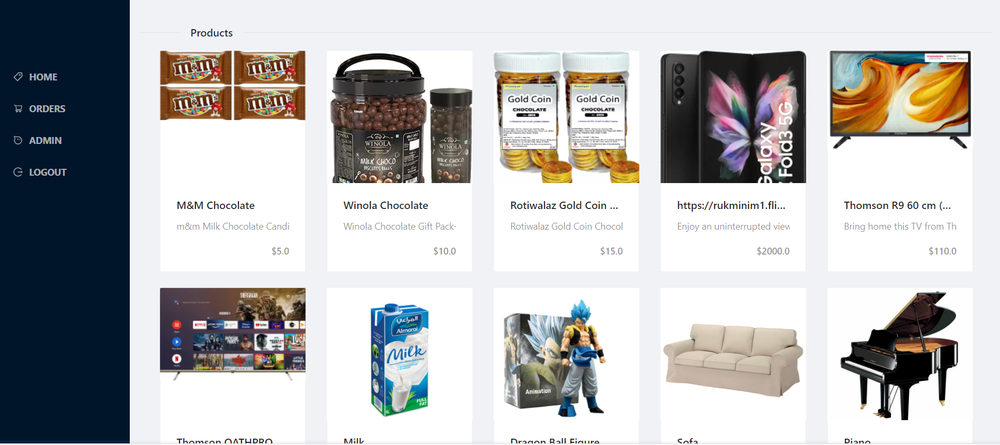

## DirectiShift -Front

> This is a website demostrate invite only signup

---

## Screen-Shot

## Built With

-   React
-   JavaScript
-   CSS
-   Redux
-   VsCode

## Getting Started

To get a local copy of this project just do the following:

-   Clone the repository using `https://github.com/Hector096/Directshift-front.git`
-   Browse into the project's directory using `cd Directshift-front`
-   Install all the dependencies using `npm install`
-   Start the server using `npm start`

## Authors

👤 **Vishal Verma**

-   GitHub: [@Hector096](https://github.com/Hector096)
-   LinkedIn: [@hector096](https://www.linkedin.com/in/hector096/)

## 🤝 Contributing

Contributions, issues, and feature requests are welcome!

Feel free to check the [issues page](https://github.com/Hector096/Directshift-front/issues).

## Show your support

Give a ⭐️ if you like this project!

## Acknowledgments

-   As required by the Creative Commons License, we give appropriate credit to the author of the original design who is Murat Korkmaz.

-   Thanks to the Microverse team for the great curriculum.

## 📝 License

This project is [MIT](./MIT.md) licensed.
